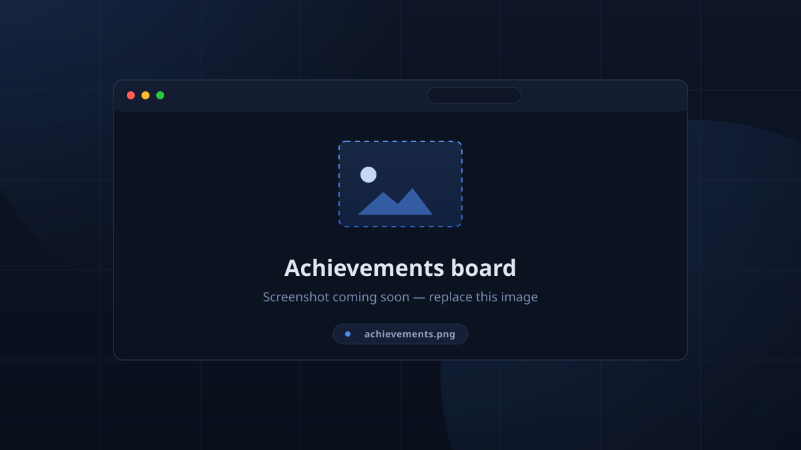

# Achievements & Badges

TimeKeeper tracks **achievements** — earned by hours, streaks, attendance and
the occasional ritual — that award a **title**. They're computed server-side;
nothing lives on the client.

## The Achievements view

- **Team panel** (left): every member ranked by `earned/total`, with a
  completion progress bar per member.
- **Board** (right): selecting a member shows their **title card**,
  a **Unlocked** section, a **Still to get** section, and
  **"…and N kept secret until earned."**

<!-- CAPTURE: achievements — Achievements board with member panel and title card -->

## Rarity

Each achievement has a rarity band, measured against your **active members**:

| Band | Meaning |
|------|---------|
| **Legendary** | earned by a very small share of active members |
| **Rare** | a small share |
| **Uncommon** | a moderate share |
| **Common** | most active members |
| **Everyone** | earned by every active member |
| **Unclaimed** | held by no one |
| **Unrated** | no active members yet |

"Active members" = distinct members with **at least one attendance** (any
session), so rarity is based on the people actually coming, and won't inflate
because the roster is full of members who never check in. The UI shows
`Rare · 17% of active members`, and badges use the label in their tooltip.

## Hidden badges

Unearned secret achievements render as a **Secret** tile with a
**«?»** icon; earning one reveals it. The tooltip on any badge explains
how to earn it and, where relevant, how many of your active members hold it
(*"Not yet earned"* for the rest).

## Badge catalogue

The full, browsable catalogue is the **badges** page in the app — and, on
Discord, `!awards all` walks it the same way, 8 per page, Prev/Next buttons.
See [Discord Bot](../discord/discord.md#commands).

## Discord

Your own collection is queried with `!awards` (default = the caller's),
`!awards all` to flip through the whole catalogue (8 per page, Prev/Next
buttons), and `!awards help` for usage. `!mystats` shows your title and rank
alongside hours. All of it shares the same server-side definitions as the
app, so the two can never drift apart.
