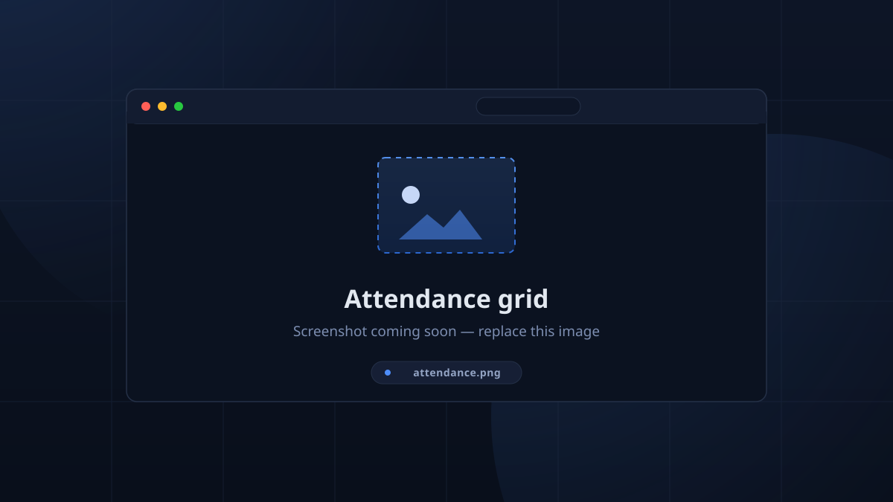

# Check-in & Attendance

Members get in and out through the **[kiosk](../kiosk/kiosk.md)** (RFID / PIN),
the manual buttons on the **Team** table, or the **Discord** `!checkout`. All of
it lands in the same table: **team_member_sessions**.

## The Attendance view (admin)

A **records-management grid** rather than a "who's in the room" board (that live
list is the kiosk's checked-in panel).

Columns: `Member`, `Session`, `Check In`, `Check Out`, `Status`
(**Checked In** / **Completed**).

Filters:

| Filter | Options |
|--------|---------|
| Session | dropdown |
| Location | dropdown |
| When | Any time / Today / Last 7 days / Last 30 days |
| Member type | All / Students / Mentors |
| State | All states / Checked in / Completed |
| Search | *"Search members..."* |

Row actions:

- **Edit Check-In** — opens pickers for check-in and check-out times (correct a
  mis-tap, or fix a scanned time).
- **Delete** — remove a record.
- **Clear All Attendance** — wipe the whole table (with confirmation).

<!-- CAPTURE: attendance — Attendance page with filters + a row selected -->

## Manual check-in / check-out

The same mutation powers everything, and **toggles**: if the member is checked
in anywhere they are checked out, otherwise checked in.

- **Team table** rows carry per-member **Check In** / **Check Out** buttons.
- The kiosk's **Kiosk Check In / Out** dialog searches members and toggles rows.
- The **Discord** `!checkout` lets a linked member check themselves out.

These write to `team_member_sessions`, which the `kiosk` role and any
`team_member_sessions: write` grant allow.

## Check-in windows

A tap counts as checking in to a session only when it is **within 4 hours of**
that session's start **or end** (configurable via
[Check-in Window](../admin/settings.md)). With no qualifying active session the
kiosk reports *"No active session at this location."* Full mechanics on the
[Check-in Windows & Auto Checkout](../kiosk/checkout.md) page.

## What happens at the end

- A session whose end has passed enters **overtime** for anyone still checked
  in (kiosk counts it as `OVERTIME` in red).
- After the grace period (24 h by default) — or the moment the **next session
  at that location** starts — lingering members are **auto-checked-out** at the
  session's end time, and a Discord DM is offered.
- Sessions with nobody left checked in are marked **Finished**.

All of this is recorded with a source of truth (kiosk / RFID / Discord / auto)
and shows up in Leaderboard & Statistics as regular vs overtime hours.
