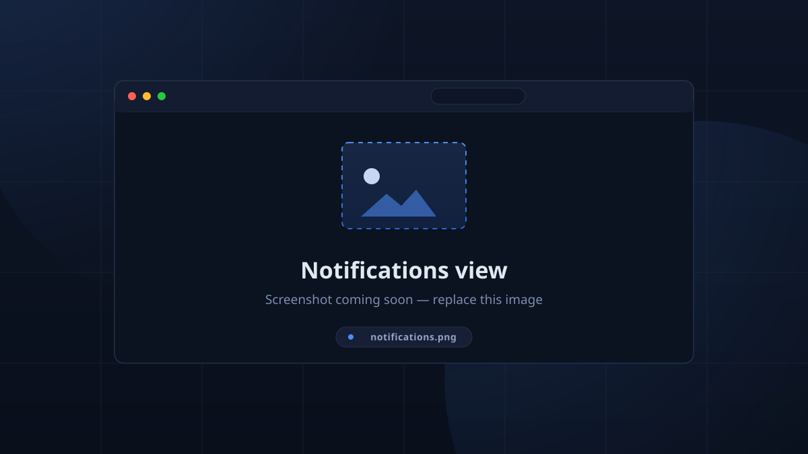

# Notifications & RSVP

## Notifications (admin)

The **Notifications** view is the history/schedule of Discord-facing messages
TimeKeeper generates. It is populated by the server's reminder engine — the
client only reads and (re)cancels.

Columns: `Type`, `Session`, `Member`, `Status`, `When`.

| Type | Trigger |
|------|---------|
| **Session Start Reminder** | `start - mins` before a session (announcement channel) |
| **Session End Reminder** | `end - mins` before a session (announcement channel) |
| **Overtime** | `end + mins` after a session, member still checked in (per-member DM) |
| **Auto Checkout** | member auto-checked-out after the grace period (per-member DM) |

Status is one of **Scheduled / Sent / Skipped / Cancelled / Failed**:

- `Scheduled` — due in the future.
- `Sent` — delivered to Discord.
- `Skipped` — a late start reminder the operator chose not to fire at session
  creation.
- `Cancelled` — you cancelled it from this view (or the session was edited with
  changed times).
- `Failed` — Discord rejected the message (terminal).

### Managing them

- The **Add** button schedules a type against a session (optionally one member).
- Editing is deliberately **cancel-only**: once a notification is pending you can
  take it out of the schedule but not retarget it.
- Deleting a **session** cascades its notifications automatically.

<!-- CAPTURE: notifications — Notifications table with statuses visible -->

## RSVP

RSVP is per-member *per-session*: `going` or `not_going`.

- Set via Discord **👍 / 👎 reactions** on start-reminder messages (toggle:
  *Start Reminder RSVP Reactions*; the reaction handler upserts/clears the
  RSVP).
- Shown as *"Going: N, Not Going: M"* wherever sessions appear, and as the
  `event_available` / `event_busy` counts on the kiosk.
- **Feeds the kiosk's expected count**: expected = max(RSVP-going,
  unique members who showed up), so a session with a big "going" count starts
  with a realistic target that checking in can still beat.

## Templates & placeholders

Reminder messages are templated. The full placeholder set:

`{location}`, `{date}`, `{start_date}`, `{end_date}`, `{start_time}`,
`{end_time}`, `{start_date_time}`, `{end_date_time}`, `{relative_day}`,
`{weekday}`, `{end_weekday}`, `{mins}` (reminders only) — and for DMs,
`{username}` (a Discord mention) and `{name}`.

The default templates ship with `@here` pings so members actually see them;
templates are plain message content on purpose — mentions inside embedded
content silently don't notify anyone.

## Auto-delete

When *Auto Delete* is enabled for start/end reminders, each message is deleted
from Discord once its session's time has passed. Useful for keeping the
announcement channel pristine when reminders are the main traffic.
