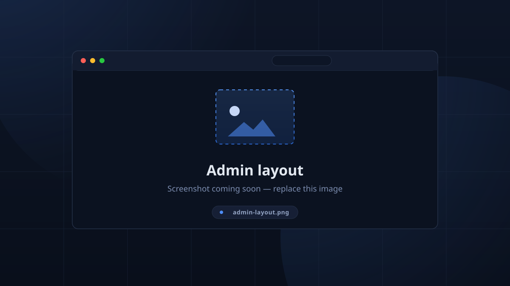

# Overview

The TimeKeeper app is a **Flutter** client that runs the same on desktop, web
and Android. It's an application and dashboard — not a cloud web app: the
`server` can serve a web build of the same client to a browser, but the exact
same app logic exists in a regular desktop application. Everything updates
**live** — sign a member in anywhere and every open screen follows.

## What you see without an account

| Page | Who sees it | What it is |
|------|-------------|------------|
| **Home** (/) | everyone | The **kiosk**: current session, check-in counts, checked-in list. See [Kiosk Mode](../kiosk/kiosk.md). |
| **Leaderboard** | everyone | Hour totals and rank, with overtime shown separately. |
| **Calendar** | everyone | Read-only month view of sessions. |
| Device **Settings** (gear) | everyone | Device location, kiosk mode, server address / TLS. |
| **Login** (person icon) | everyone needed | Username + password overlay. |

## The admin rail

Once you hold admin permissions, a **left rail** appears with the management
pages:

- **Setup** — server configuration, imports, Discord, branding, database.
- **Users** — login accounts and their roles.
- **Team** — team members and their tags/PINs/Discord links.
- **Sessions** — the calendar/table and the attendance records.
- **Locations** — where sessions happen.
- **Notifications** — scheduled reminders and their delivery status.
- **Attendance** — the check-in/check-out records grid.
- **Achievements** — titles and badges progress.
- **Statistics** — KPIs, charts and CSV export.

The rail renders only for admins; the rest of the app is public where it makes
sense (leaderboard, calendar, kiosk).

<!-- CAPTURE: admin-layout — desktop browser, admin rail expanded, Sessions page open -->

## Accounts vs team members

TimeKeeper keeps two different people sets apart, and it matters while you're
administering it:

- **Users** — people who can *sign in* to operate the system (admins, kiosk
  operators). They live in **Users**.
- **Team members** — students and mentors being *tracked* (hours, check-ins,
  leaderboard, badges). They live in **Team** and have no username or password.

> "What this account can do in TimeKeeper. This is not team membership —
> students and mentors live under Team and have no login. Without a role a
> user can sign in but do nothing else."
>
> — the Users dialog, verbatim

## Login & first login

1. Tap the person icon in the top bar.
2. Enter `Username` / `Password` (hints: *"Enter username, e.g `admin`"*).
3. On success the overlay closes and the rail (if admin) appears.

There is **no onboarding wizard**: on first run the client talks to
`127.0.0.1:4000` (default) — change that in the gear **Settings**. On web the
API is always the page's own origin, so those fields are hidden.

## Connection health & updates

- The app polls `/health` every 10 s; an unreachable server turns the app bar red
  with title **Disconnected**.
- A built-in updater compares the client's version (`TK_VERSION`) with the
  server every 3 h and offers **A newer TimeKeeper is available** with
  *Copy link* / *Later* — even on the login screen.

## What happens on login

On a fresh login the client re-fetches every subscribed collection, then
continues applying realtime deltas. This means permissions edits, member
changes, even settings toggles appear everywhere within a moment.

| Topic | Where to read next |
|-------|--------------------|
| Sessions, calendar, schedules | [Sessions & Calendar](sessions.md) |
| Checking people in/out, records | [Check-in & Attendance](attendance.md) |
| Members, tags, locations | [Team Members & Locations](team.md) |
| Hours, KPIs, charts | [Leaderboard & Statistics](statistics.md) |
| Titles and rarity | [Achievements & Badges](achievements.md) |
| Reminders history | [Notifications & RSVP](notifications.md) |
