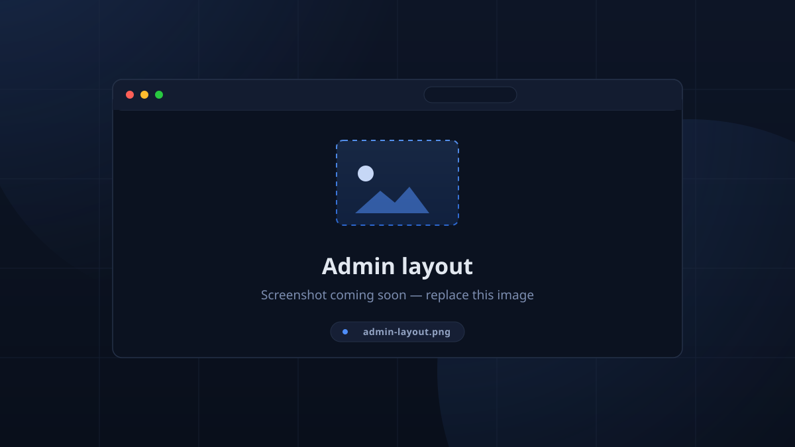

# Overview

The TimeKeeper app is a **Flutter** client that runs the same on desktop, web
and Android. It's an application and dashboard — not a cloud web app: the
`server` can serve a web build of the same client to a browser, but the exact
same app logic exists in a regular desktop application. Everything updates
**live** — sign a member in anywhere and every open screen follows.

## What you see without an account

| Page | Who sees it | What it is |
|------|-------------|------------|
| **Home** (/) | everyone | The **kiosk**: current session, check-in counts, checked-in list. See [Kiosk Mode](../kiosk/kiosk.md). |
| **Leaderboard** | everyone | Hour totals and rank, with overtime shown separately. |
| **Calendar** | everyone | Read-only month view of sessions. |
| Device **Settings** (gear) | everyone | Device location, kiosk mode, server address / TLS. |
| **Login** (person icon) | everyone needed | Username + password overlay. |

## The admin rail

Once you hold admin permissions, a **left rail** appears with the management
pages:

- **Setup** — server configuration, imports, Discord, branding, database.
- **Users** — login accounts and their roles.
- **Team** — team members and their tags/PINs/Discord links.
- **Sessions** — the calendar/table and the attendance records.
- **Locations** — where sessions happen.
- **Notifications** — scheduled reminders and their delivery status.
- **Attendance** — the check-in/check-out records grid.
- **Achievements** — titles and badges progress.
- **Statistics** — KPIs, charts and CSV export.

The rail renders only for admins; the rest of the app is public where it makes
sense (leaderboard, calendar, kiosk).



<!-- CAPTURE: admin-layout — desktop browser, admin rail expanded, Sessions page open -->

## Accounts vs team members

TimeKeeper keeps two different people sets apart, and it matters while you're
administering it:

- **Users** — people who can *sign in* to operate the system (admins, kiosk
  operators). They live in **Users**.
- **Team members** — students and mentors being *tracked* (hours, check-ins,
  leaderboard, badges). They live in **Team** and have no username or password.

> "What this account can do in TimeKeeper. This is not team membership —
> students and mentors live under Team and have no login. Without a role a
> user can sign in but do nothing else."
>
> — the Users dialog, verbatim

## Login & first login

1. Tap the person icon in the top bar.
2. Enter `Username` / `Password` (hints: *"Enter username, e.g `admin`"*).
3. On success the overlay closes and the rail (if admin) appears.

There is **no onboarding wizard**: on first run the client talks to
`127.0.0.1:4000` (default) — change that in the gear **Settings**. On web the
API is always the page's own origin, so those fields are hidden.

## What the app holds, and what it asks for

TimeKeeper is an application, not a web page, and it keeps a small amount of reference data live in
memory so navigating between views is instant and every screen agrees with every other one. What it
holds is deliberately bounded:

| Held live from login | Why | Size |
|---|---|---|
| Locations, Team Members, Sessions, RFID Tags, RSVPs | Resolving ids to names on almost every screen, and matching a scanned card at the kiosk | hundreds of rows |
| Who is checked in right now (`openAttendance`) | The kiosk board, the roster's Check In/Out button, the scan path | bounded by the size of the team |

The API returns **nested relationships**, so a view asks for the shape it renders rather than for
ids it then has to look up. An attendance row can carry its member and its session's location:

```graphql
attendance(filter: { ... }, limit: 25) {
  items {
    checkInTime
    checkOutTime
    teamMember { displayName memberType }
    session { startTime location { location } }
  }
}
```

**Every foreign key in the database is a nested field, in both directions.** A session resolves its
`location`, `attendance`, `rsvps` and `notifications`; a member resolves their `attendance`,
`rfidTags`, `rsvps`, `notifications` and `stats`; an attendance row resolves its `teamMember`,
`session` and `stats`. The id stays available alongside the object for callers that only want it.

Three rules keep that safe rather than merely convenient:

- **Batched.** Each relationship is resolved by a data loader, so a page of any size costs one query
  per relationship *level*, not one per row.
- **Capped.** A has-many field returns 100 rows by default and 1000 at most, and takes a `limit`.
  An unbounded nested list is a way to ask for a member's entire history by accident.
- **Permission-checked.** A nested field enforces the same read permission its top-level query does.
  A relationship is not a way around the permission model.

Queries may nest up to 20 levels deep; beyond that the server rejects them, because with
relationships in the schema the caller chooses the depth.

A selection set that only wants ids still only pays for ids.

Every list view now asks this way, so **no screen resolves an id against a local copy of a table**.
What the client still holds live is the sets that are genuinely *whole-set* questions: the location
dropdowns, the member and session pickers, the calendar's month grid, and the kiosk's RFID tag set
(matching a scanned card without a round trip).

Everything else is **asked for when it is needed**, in the shape it is needed:

- **Lists** are server-paged and server-filtered — the page you see is the rows that were fetched.
- **Counts** are counted in SQL (`sessionAttendanceCounts`, `attendanceSummary`), not by walking a
  local copy of a table.
- **Aggregates** (leaderboard, achievements) are computed server-side and re-requested once the
  underlying data has been quiet for a moment, so a burst of check-ins costs one recomputation.
- **The attendance history** — the one table that grows without bound — is downloaded only by the
  two things that genuinely need every row: the Statistics dashboard and the CSV export. Opening
  either is the only time the client pulls it.

That last point used to be false: every login downloaded the entire attendance table (several
megabytes after a season or two) before the first screen settled, which is what made the app feel
slow on a server that is not on the same continent.

## Connection health & updates

- The app polls `/health` every 10 s; an unreachable server turns the app bar red
  with title **Disconnected**.
- A built-in updater compares the client's version (`TK_VERSION`) with the
  server every 3 h and offers **A newer TimeKeeper is available** with
  *Copy link* / *Later* — even on the login screen.

## What happens on login

On a fresh login the client re-fetches every subscribed collection, then
continues applying realtime deltas. This means permissions edits, member
changes, even settings toggles appear everywhere within a moment.

| Topic | Where to read next |
|-------|--------------------|
| Sessions, calendar, schedules | [Sessions & Calendar](sessions.md) |
| Checking people in/out, records | [Check-in & Attendance](attendance.md) |
| Members, tags, locations | [Team Members & Locations](team.md) |
| Hours, KPIs, charts | [Leaderboard & Statistics](statistics.md) |
| Titles and rarity | [Achievements & Badges](achievements.md) |
| Reminders history | [Notifications & RSVP](notifications.md) |
