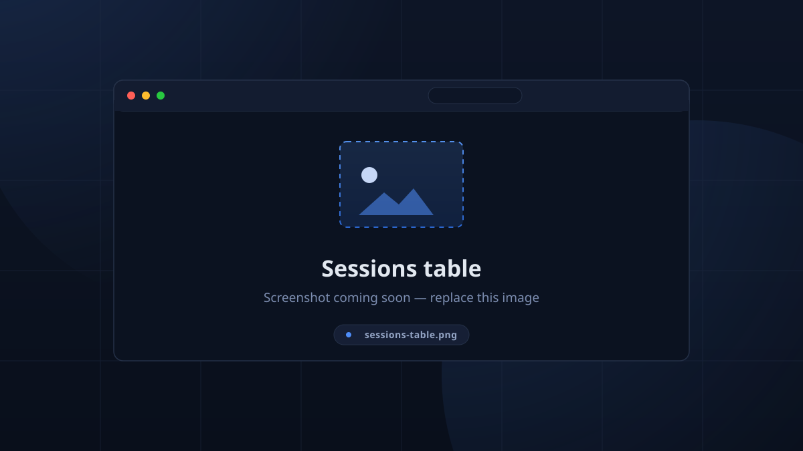
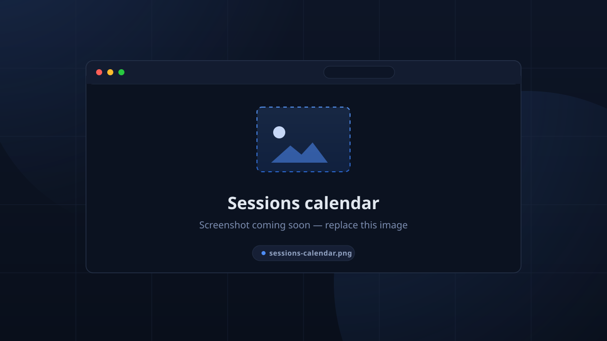

# Sessions & Calendar

A **session** is a signed-in interval at a **location** — TimeKeeper sessions
have no name; identity is *date / time / location*.

## Sessions page

The **Sessions** view (admin) has a **Calendar / Table** toggle:

- **Calendar** — a month grid; day markers are coloured by session status.
  "Showing: &lt;date&gt;" + *Clear filter*.
- **Table** — server-paged rows with filters:
  - **Location** (searchable dropdown),
  - **All / Scheduled / Finished**,
  - **Pick a day** date filter, *Clear filters*, and a free-text **TableFilter**.

Above the table, the KPI row shows **Total · Active · Upcoming · This Month ·
Unique Members**.

Columns: `Date`, `Time`, `Duration`, `Location`, `Members` (count coloured by
status), `RSVPs` (*going / not going*), and `Status` — plus view/edit/delete.

<!-- CAPTURE: sessions-table — Sessions page, table mode, filters visible -->

<!-- CAPTURE: sessions-calendar — Sessions page, calendar mode, a day selected -->

## Creating / editing a session

From the new/edit dialog:

- **Start** and **End** (end must be after start),
- **Location**,
- on **edit only**, a **Finished** switch (marks the session done; used to stop
  check-ins or re-open).

### Reminder preview

When a session is created, the Discord reminder for it is **dry-run**:
- if the reminder window is still in the future it is scheduled silently,
- if the lead time has already elapsed, TimeKeeper asks
  **"Send reminder now?"** — *"The session is created either way — this only
  decides whether the reminder goes out."* Choose **Send now** or **Skip**
  (a skipped reminder is recorded as `skipped` in the Notifications view).

Deleting a session cascades its notifications and RSVPs — the Notifications
table and the attended-members records go with it.

## Merging a schedule

Rather than clicking, teams usually **upload a whole schedule** (CSV or ICS)
from **Setup → Sessions**. Uploading warns:

> **"Uploading a schedule can have impacts on existing data integrity"**

i.e. schedule CSV/ICS replaces the session plan (see
[Import & Export](../admin/import_export.md)). Verify your snapshot matches the
files before uploading.

## The public Calendar

The top-bar **Calendar** is the read-only version: same month grid and table
toggle, no RSVP counts or record management. Point members at it for
"what's on today".

## RSVPs per session

Anywhere sessions appear, RSVPs show as *"Going: N, Not Going: M"*. RSVPs come
from Discord 👍/👎 reactions on start reminders (see
[Notifications & RSVP](notifications.md)) and feed the
[kiosk's expected counts](../kiosk/kiosk.md).
