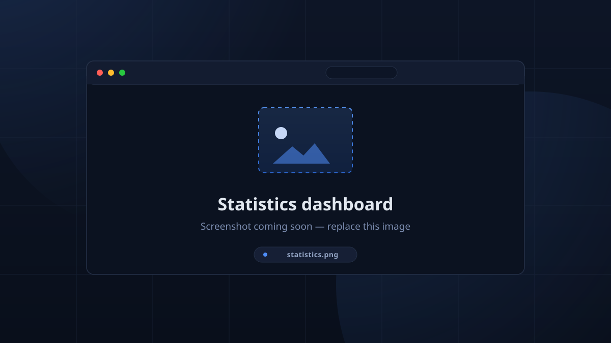

# Leaderboard & Statistics

## Leaderboard (public)

The top-bar **Leaderboard** is a public, read-only board: `#`, `Member`, `Type`,
`Session`, `Week`, `Total`, with the top three bolded in the primary colour.
Overtime shows as `+1h 30m` in red (unless *Show Overtime Separately* is off).
Its subtitle carries a member count; its empty state is *"No data yet"*.

What appears here is configured under
[Leaderboard Configuration](team.md#leaderboard-configuration). The Discord
`!leaderboard` command shares the same rules.

## Statistics (admin)

**Setup → Statistics** is the analytics dashboard. Everything is computed
client-side from the live collections — no polling.

### Range & filters

- Range menu: *Today, Last 7 days, Last 30 days, Last 90 days, This week,
  This month, Year to date, All time, Custom range…*
- **Locations** (multi-select) and **Member type** filters.
- **Export CSV** — headers: `Member, Type, Regular, Overtime, Total, Sessions,
  Overtime %`.

### KPI strip

**Total hours**, **Regular**, **Overtime**, **Overtime %**, **Sessions**,
**Members**, **Check-ins**, **Avg / session** — each with a period-over-period
delta chip.

### Panels

- **Activity over time** — bar series with a Regular/Overtime legend, a metric
  toggle, and D/W/M bucketing.
- **Location ranking** — ranked by total time logged.
- **Members** grid — Member, Type, in-cell Total bar, `Sessions`, and an
  **OT %** meter with a warning chip when a member is deep in overtime; an
  *Overtime only* chip narrows to them.
- **Check-in rhythm** — a weekday × hour heatmap of when people show up.
- **Day detail — &lt;date&gt;** — a drill-down inspector once you click a day.

<!-- CAPTURE: statistics — Statistics with the KPI strip, activity chart and members grid -->

## Definitions worth knowing

| Term | Meaning |
|------|---------|
| Regular | Time inside a session's bounds (check-out before its end). |
| Overtime | Time a member stayed checked-in *after* the session's scheduled end, recorded at checkout (manual late checkout is also marked). |
| Unique members | Distinct members with at least one attendance — this drives achievement rarity and the KPI row. |
