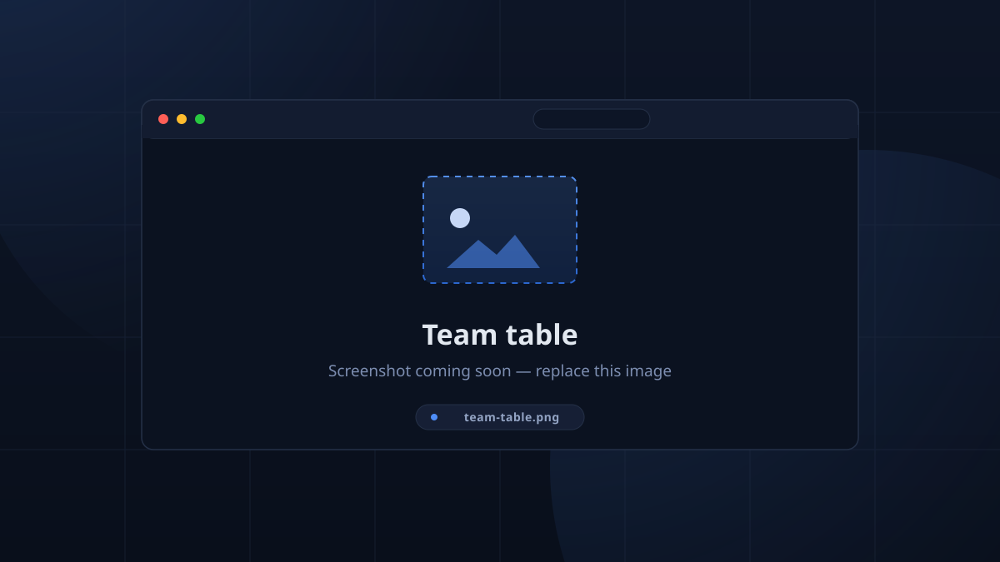
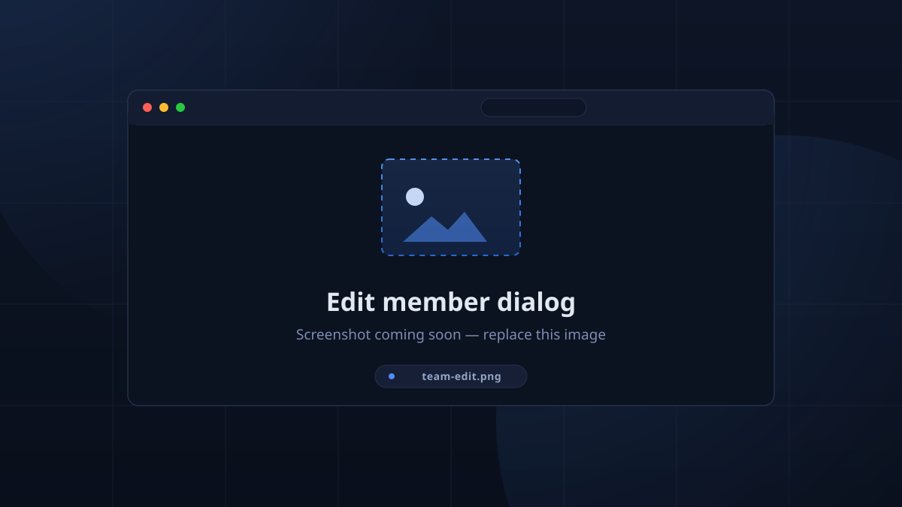

# Team Members & Locations

## Team Members

The **Team** view is where the tracked roster lives — the students and mentors
whose hours are counted.

Columns: `First Name`, `Last Name`, `Type`, `Display Name`, `RFID Tags`,
`Discord`, `PIN`, `Status`.

Filters: member type (*All / Students / Mentors*), link state (*All links /
Linked / Unlinked*), free text, refresh, and destructive **Clear Students** /
**Clear Mentors** / **Clear All** buttons.

### Add / edit a member

- **First Name**, **Last Name**
- **Type** segmented button: **Student** / **Mentor**
- **Display Name** (optional — overrides the name for display and Discord
  mentions)
- **RFID Tags**: existing tags listed with remove; an **Add RFID Tag** field
  plus a **scan button** (desktop can capture a live card)
- **Discord ID** (optional) — *"Numeric user ID — enable Developer Mode in
  Discord, right-click the user and Copy User ID"*
- **Quick PIN** (optional) — up to **50** digits; TimeKeeper enforces it be
  **unique** among members. It is the server-side PIN used by the kiosk.

<!-- CAPTURE: team-table — Team view with a member row selected -->

<!-- CAPTURE: team-edit — the member add/edit dialog, RFID section expanded -->

### Getting members in fast

- [Import a CSV](../admin/import_export.md#team-members) of students or mentors.
- Import from a **Discord role** (Setup → Integrations → *Fetch Roles* →
  *Import as Students / Mentors*).
- Link existing Discord accounts on the spot: a member can run `!link` in
  Discord, or an admin scans an unlinked card at the kiosk.

> The default `admin` *user* is **hidden** from this list — it is a login, not a
> team member ("The default admin user is hidden from this list").

## Locations

A **location** is where sessions happen and where a device pins itself for
kiosk duty. The Locations view is a simple list with add/edit/delete and
**Clear All**.

Set each device's **Device Location** in the gear Settings — the kiosk only
interacts with *its* location's current session.

## Leaderboard configuration

Under **Setup → Team Members → Leaderboard Configuration** two options control
the leaderboard (app *and* the Discord `!leaderboard`):

- **Member Types on Leaderboard** — which types participate (default: student +
  mentor, both selected),
- **Show Overtime Separately** (default on) — overtime renders as `+1h 30m` in
  red after regular hours instead of being folded in.
