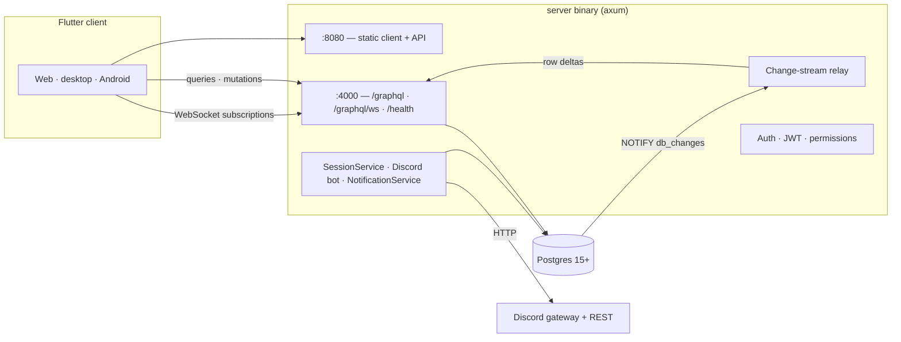
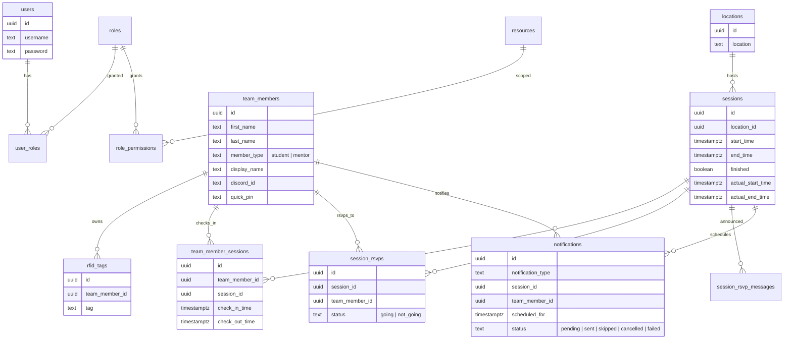
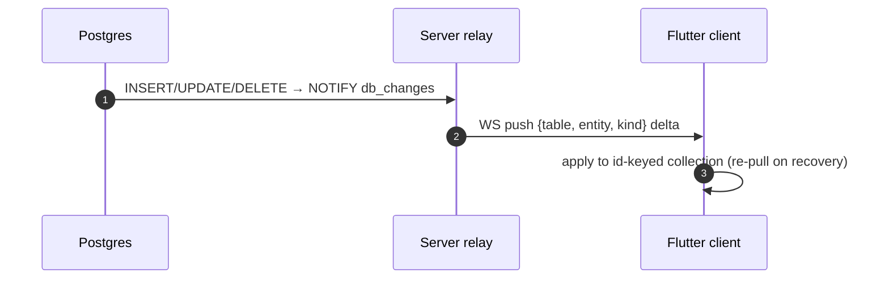

# Architecture

TimeKeeper is a **Rust** server (axum + async-graphql + Diesel) with a
**Flutter** client. All real-time behaviour is driven by Postgres change
notifications pushed over GraphQL WebSocket subscriptions.

## High-level picture

### Clients

The Flutter app targets **web, desktop (Linux/macOS/Windows) and Android**, one
codebase. It never queries for data it can subscribe to: each collection is
"seeded by query, kept current by a change subscription", with a re-pull on the
change stream's recovery after an outage (so missed deltas are never silently
dropped).

Only three things poll: `/health` every 10 s, a 30 s minute-quantiser for the
statistics dashboard, and the server version check every 3 h.

### Server internals

| Piece | What it does |
|-------|--------------|
| Web listener (`:8080`) | Serves the compiled Flutter build *and* the API on the same origin; sets `application/wasm` + cross-origin isolation headers for the Wasm build. |
| API listener (`:4000`) | `/graphql`, `/graphql/ws`, `/health`. Same handler set as the web listener. |
| Change stream | Postgres triggers `NOTIFY db_changes` on every write (`0001_init/up.sql`); the relay re-broadcasts rows to subscribed clients by table. |
| SessionService | Every 5 s: checks auto-checkout for past-end sessions, marks sessions finished, yesterday's sweeps. |
| DiscordNotificationService | Every 60 s: fires due reminders/DMs, deletes sent ones if auto-delete is on, syncs Discord nicknames. |
| Discord gateway bot | Prefix `!` chat commands, RSVP 👍/👎 reactions, maintenance gate. |
| Auth | JWT (7-day expiry) with a permissions snapshot resolved at login. |

The web port is optional — `--no-web` yields a pure API server for
[reverse-proxied production](deployment.md).

## Data model

`settings` is a deliberately single-row table (all server config), as are
`secret` (JWT signing secret) and `logos` (branding). Migrations live in
`database/migrations/` (Diesel) — including schema-based views
`permissions_effective` and `user_permissions` that power authorization.

## Realtime pipeline

## Authorization

- A **role** may be `is_super` (bypasses every grant) or carry explicit
  `resource → level` rows.
- Levels are **read < write < delete**, ceiling semantics: `write` satisfies a
  `read` requirement.
- Effective per-user permissions come from the `user_permissions` view (max
  level across the user's roles), then snapshotted into the JWT at login.
- Every server mutation re-checks the claim server-side; the client's rail/UI
  gating is convenience, not security.

See [Users, Roles & Permissions](../admin/users.md).

## Related

- [Running the server](server_reference.md) — listeners, ports, env.
- [Check-in Windows & Auto Checkout](../kiosk/checkout.md) — what the
  SessionService enforces.
