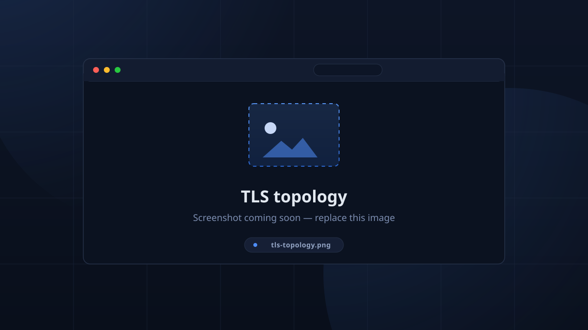

# Configuration

TimeKeeper configuration lives in three places: environment variables on the
server, the in-app **Settings** catalog stored in the database, and device-local
settings on each client.

## Server environment

See [Running the server](server_reference.md#environment-variables) for the full
table (`DATABASE_URL`, `TK_ADMIN_PASSWORD`, `RUST_LOG`).

## In-app settings (database)

The bulk of TimeKeeper is configured from **Setup**, the admin configuration
page. Every field is described in the [Settings Reference](../admin/settings.md),
including defaults.

## Device settings (per client)

From the gear icon in the top bar (device-local, not the server):

| Setting | Default | Notes |
|---------|---------|-------|
| Device Location | — | Required for kiosk check-in. "This device has no location set. Choose one in Settings before checking in." |
| Kiosk Mode | off | Lock the app fullscreen and always-on-top. **Desktop platforms only.** |
| Scan Debounce (minutes) | `5` | Minimum time between two RFID scans of the same card. |
| Use TLS (HTTPS/WSS) | off | Web only through the page origin; on desktop/Android this toggles `https://` + `wss://`. |
| Server Address | `127.0.0.1` | Where the API lives (`:4000` default port). Hidden on web — the web build always talks to its own origin. |
| GraphQL Port | `4000` | API port. |

## Timezone

Sessions store absolute UTC times; the **Timezone** setting is a UTC offset used
for display and schedule interpretation. Set it in **Setup → Sessions**.

## Encryption and authentication

- Authentication is **JWT-based**. Tokens carry the user id and a *snapshot* of
  their permissions at sign-in, and expire after **7 days**.
- On first boot the server generates a random **secret**, stores it in its own
  `secret` row, and signs/verifies tokens with it. Nothing is stored in plain
  config files; anyone who can read your database can mint tokens, so keep the
  database credential private.
- Permission changes take effect on a user's **next login** (the snapshot is
  taken at sign time).
- There is **no additional at-rest encryption** of session data. The `admin`
  password is hashed, and tokens are signed.

## TLS

The server does not terminate TLS itself; it exposes plain HTTP listeners and
expects a reverse proxy in production.

<!-- CAPTURE: tls-topology — simple diagram (reverse proxy → :4000/:8080 → Postgres) -->

| Where | How to get TLS |
|-------|----------------|
| Production web | **Caddy** (see [Deployment](deployment.md)) — automatic HTTPS for `tk.roboticswest.org`, proxies `/graphql*`, `/health`. |
| Desktop / mobile clients | The device **Settings → Use TLS** toggle upgrades API calls to `https`/`wss`; pair it with a trusted certificate on the reverse proxy. |
| The web client | Always uses the page's origin — TLS follows whatever the proxy serves. |

## Troubleshooting quick guide

- **App bar red · Disconnected** — `/health` unreachable: wrong Server Address/Port,
  TLS toggle mismatch, or the server process is down.
- **Kiosk won't check in** — no Device Location set, or no active session within
  the [check-in window](../kiosk/checkout.md).
- **"A newer TimeKeeper is available"** — the client compares its built version
  against the server every 3 h; either side being upgraded triggers it.
