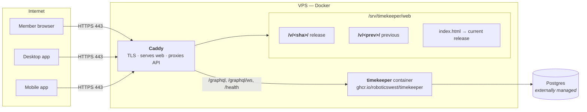
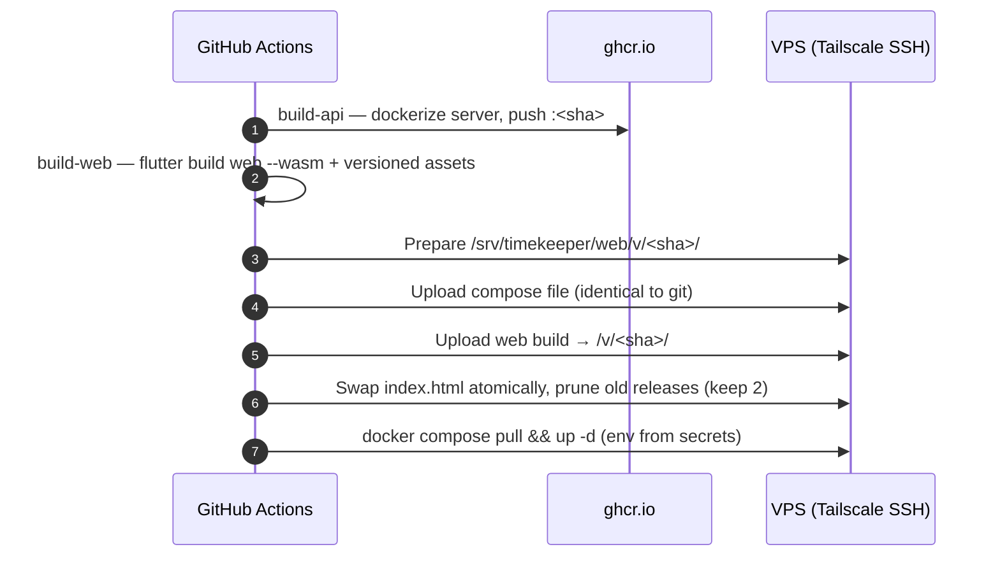

# Deployment

This page walks through the production layout that runs
`tk.roboticswest.org`: a single-server Docker install with automatic TLS, plus
the CI/CD pipeline that ships it.

## The production shape



Key facts:

- **One container.** `deploy/timekeeper/docker-compose.yml` runs only the API
  (`timekeeper`) with no web listener — Caddy serves the web build and proxies
  the API.
- **Managed Postgres.** `DATABASE_URL` points at an external instance; the
  container never owns the database.
- **Two hostnames** — `tk.roboticswest.org` and `timekeeper.roboticswest.org`
  alias the same site.
- **TLS for free.** Caddy provides automatic HTTPS certificates (see
  `deploy/Caddyfile.example`).

## Caddy

`deploy/Caddyfile.example` is a reference site block. Its cache rules matter:

- `/v/<commit>/*` — **immutable** (`max-age=31536000`), unique per release, so
  the browser never revalidates.
- root `index.html` — **no-cache**: it points every load at the current release.
- `/graphql*` and `/health` — reverse-proxied to `timekeeper:4000`.

```text
tk.roboticswest.org, timekeeper.roboticswest.org {
    handle /v/* {
        root * /srv/timekeeper/web
        file_server
        header Cache-Control "public, max-age=31536000, immutable"
    }
    handle /graphql*  { reverse_proxy timekeeper:4000 }
    handle /health    { reverse_proxy timekeeper:4000 }
    handle {
        root * /srv/timekeeper/web
        try_files {path} /index.html
        file_server
        header Cache-Control "no-cache"
    }
}
```

## CI/CD

`.github/workflows/deploy.yml` deploys on every push to `main` (and manually via
`workflow_dispatch`). It is three jobs:



- **build-api** — builds the Docker image (`deploy/timekeeper/Dockerfile`) with
  `containerd` build-cache mode and pushes `ghcr.io/roboticswest/timekeeper:<sha>`.
- **build-web** — `flutter build web --release --wasm` with:
  - `--base-href=/v/<sha>/` — every asset is versioned and cacheable forever,
  - `--dart-define=TK_VERSION=<version from vars.yml>` — drives the "newer
    version available" check.
- **deploy** — runs over **Tailscale** (`secrets.SSH_HOST` is a Tailscale
  address), uploads the build, atomically swaps root `index.html`, prunes all
  but the **newest two** releases (so an in-flight client can finish lazy loads),
  then rolls the container with secrets injected into `/srv/timekeeper/.env`.

!!! note "Why versioned deploys"

    Every release lives under `/v/<commit>/` with a forever cache header. A torn
    or stale `main.dart.js_*.part.js` can never be served next to a new shell,
    and rollback is just re-activating a previous release directory.

## Going from zero to production

1. Provision a VPS and a managed Postgres; install Docker and Caddy; join the
   Tailnet (deploy uses `tailscale/github-action@v3` with OAuth tags).
2. Put the GitHub [secrets](deploy.yml) in place:
   `SSH_HOST`, `SSH_USERNAME`, `SSH_PRIVATE_KEY`, `SSH_PORT`, `DATABASE_URL`,
   `TK_ADMIN_PASSWORD`, `TS_OAUTH_CLIENT_ID`, `TS_OAUTH_CLIENT_SECRET`.
3. Upload `deploy/Caddyfile.example` into your main Caddyfile (keep your shared
   `errors` snippet import).
4. Push to `main` — the pipeline takes it from there.

## Self-hosted alternative

For a single machine without the CI machinery, the
[Single binary install](install.md#single-binary) plus a reverse proxy gets the
same result. Point Caddy (or nginx) at `:4000` for `/graphql*` + `/health` and
serve `client/build/web` for everything else; enable TLS the same way.
