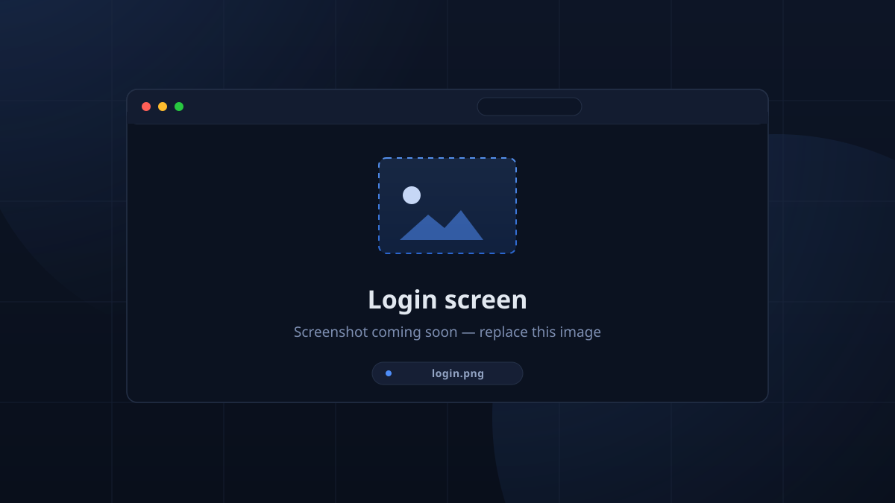

# Quickstart

Get TimeKeeper running in about five minutes with no services to install.

## 1. Run the server

You need only a Rust toolchain (see `rust-toolchain.toml`). From the repository root:

```bash
cargo run --release -p server
```

The first start compiles the server, then:

- starts an **embedded Postgres** under `./.pgdata` (you don't need to install
  or configure a database — if `DATABASE_URL` is unset it's created and
  migrated for you),
- serves the **web app** on <http://localhost:8080>,
- exposes the GraphQL API on <http://localhost:4000>.

!!! note "What the two ports are for"

    Port `8080` serves the Flutter web client *and* the API on the same origin,
    so a browser loaded from there needs no configuration. Port `4000` is the
    API-only endpoint used by desktop apps, phones and reverse proxies. More in
    the [server reference](server_reference.md).

## 2. Log in

Open <http://localhost:8080> in a browser. A fresh install has one account:

- **Username:** `admin`
- **Password:** `admin`

!!! warning "Change the admin password now"

    The default password is `admin` only until the first admin account is
    configured. Change it immediately under **Setup → Sessions → Admin
    Password**. You can also set a strong password at boot with
    `--admin-password` / `TK_ADMIN_PASSWORD`.



<!-- CAPTURE: login — the login overlay (username "admin", password field, Login button) -->

## 3. Make it yours

1. Create a few **Locations** (e.g. *Workshop*, *Mentors' office*).
2. Add **Team Members** under **Team** — manually, by CSV, or from a Discord
   role (see [Admin Quickstart](../admin/quickstart.md)).
3. Create a **Session** or upload a **schedule** (CSV/ICS).
4. Optional: enable the **kiosk** (`Setup → Sessions → Quick PIN Sign-In` or an
   RFID reader), wire up the **[Discord bot](../discord/discord.md)**, and upload
   a **logo** under Setup → Branding.

Every screen updates live — sign a member in on one device and the rest follow.

## Next steps

- [Installation](install.md) — a production-style single-binary or Docker setup.
- [Running the server](server_reference.md) — every flag, port and environment variable.
- [Admin Quickstart](../admin/quickstart.md) — the first-day checklist for a real team.
