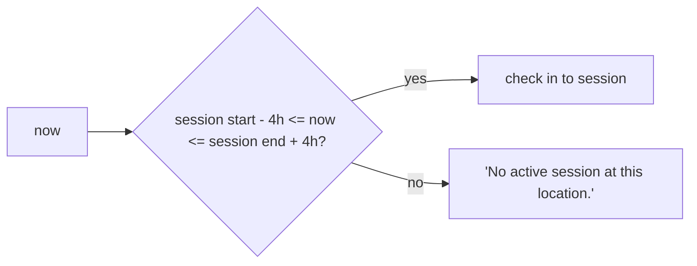
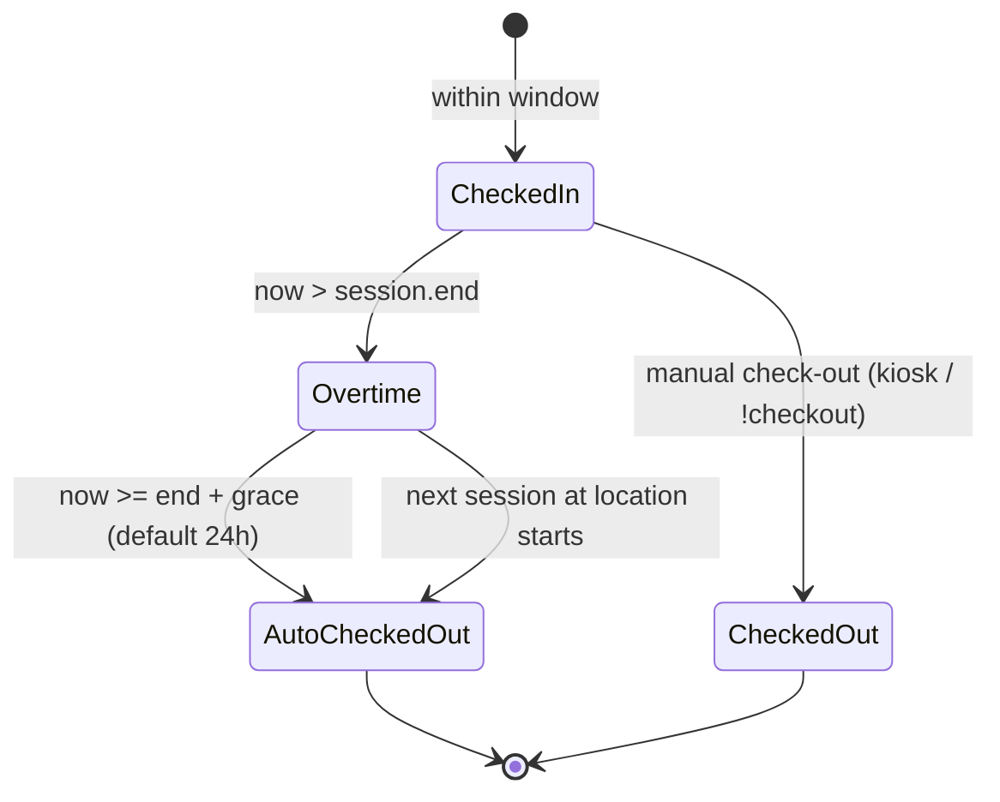

# Check-in Windows & Auto Checkout

TimeKeeper treats attendance as *"who was at this session"* — but people are
human, and sessions overlap, run late, and get forgotten. Two mechanisms make
the books come out sane: the **check-in window** and **auto checkout**.

## The check-in window (default 4 h)

A scan records a check-in for a session only when the moment falls **within
4 hours of the session's start or end** (configurable: Setup → Sessions →
*Check-in Window (hours)*).

Qualifying, unfinished sessions at the device's location are candidates; the
nearest one (distance-0 being an actually-active session) wins. So:

- Arrive 30 min early — check in to the upcoming session.
- Forget to check out at the buzzer — you're still "in" for up to 4 h past end.
- Try to tap at a dead hour with no session nearby — *"No active session at
  this location."*

## After the session ends

Two unconditional triggers force a check-out of stragglers:

1. **Grace passed** — `now ≥ session end + Auto Check-out After (default 24h)`.
2. **The next session at the same location has started.**

Everyone still checked in is force-checked-out **at the session's end time**
(i.e. their recorded hours end where the session did — overtime isn't
manufactured), the session is then marked **Finished**, and an **auto-checkout
notification** is enqueued (`Hey {username}, you've been auto-checked-out from
the session @ **{location}**…`) if enabled.

### Why two triggers?

If the workshop runs all day, sessions are back-to-back and trigger 2 fires
every time — nobody lingers. If a day ends with a lone late session, trigger 1
cleans it the next morning. Either way the kiosk's "who's still in" list is
never a graveyard.

## Overtime

As soon as a session passes its scheduled end, the kiosk shows **OVERTIME** in
red for that session. Members still signed in:

- receive an **overtime DM** (default **10 min** after end, once) telling them
  the session ended and to check out — `Hey {username}, you're now in
  overtime…`;
- if they check out late anyway, their hours show regular + overtime
  (`+1h 30m` in red) on the leaderboard and statistics — late check-outs are
  **marked** so admins see them.

## Where the defaults live

| Setting | Default | Where |
|---------|---------|-------|
| Check-in Window | 4 h | Setup → Sessions |
| Auto Check-out After | 24 h | Setup → Sessions |
| Overtime DM (mins after end) | 10 | Setup → Integrations |
| Auto-checkout DM | on | Setup → Integrations |
| Scan debounce | 5 min | device Settings |

Every one of these is configurable — the defaults exist so a fresh install
behaves sensibly with zero thought.
