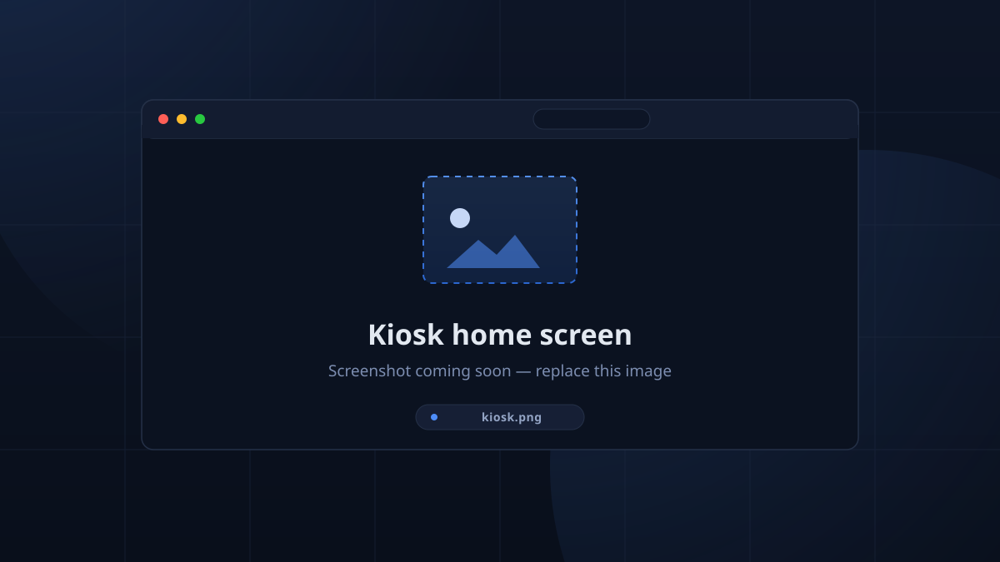
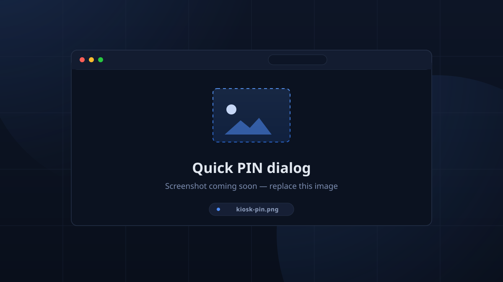

# Kiosk Mode

The kiosk is the **Home** page — the screen you point a shop monitor at. It is
the only interface a team member needs: tap a card or type a PIN and the list
updates live.

<!-- CAPTURE: kiosk — Home screen with the current session header, counts and checked-in list -->

## What it shows

For the device's location (see Device Location in the gear Settings):

**Current session card**
- **Current Session — *location*** header
- **Ends in *h:mm:ss*** countdown — flips to red **OVERTIME** once the session's
  scheduled end passes
- **checked-in / expected** (e.g. `12 / 14`) — checked-in now over expected:
  expected starts at **RSVP "going"** and rises with anyone who actually shows up
- RSVP **going** and **not-going** counts
- the session's date/time range

**Next session card**
- **Next — *location*** with **Starts in** — or **No Upcoming Sessions**.

If the current session hasn't opened its check-in window yet, the left card
becomes **Upcoming Session**; with none, **No Active Session — *location***.

**The checked-in list** — zoned rows of `Team Member · Type · Location · Time
In`, live. This is the realtime "who's in" board.

## Checking in & out

Every path **toggles**: in when out, out when in.

### RFID tap

Member taps their card on the reader (see [RFID Tags & Readers](rfid.md)).
Confirmation shows as a toast:

- **Checked In** / **Checked Out** — with their name and the time,
- **No Session** — *"No active session at this location."* (still records? No —
  the server only records when a session qualifies),
- **Unrecognized card "*value*", contact admin.** — for an unknown tag; an
  admin present can open the link flow straight from the toast,
- **Too Soon** — repeated scanning within the scan debounce window
  (*"Please wait X before scanning again."*).

### Quick PIN

If *Quick PIN Sign-In* is on (Setup → Sessions):

- **Sign In With PIN** opens a PIN field (*"Enter your PIN"* → **Check In /
  Out**).
- PINs are checked **server-side** — the raw PIN never leaves for "compare";
  the kiosk resolves it only after the server accepts it. Rate limited
  (10 failed attempts per 60 s) and only active when the toggle is on.
- The **PIN dialog suppresses the RFID scanner** while open, so a keyboard-wedge
  scanner can't treat your PIN digits as a card scan.

<!-- CAPTURE: kiosk-pin — the Quick PIN dialog open -->

### Manual

**Kiosk Check In / Out** (admin or kiosk-role operator) opens a searchable
member list; each row toggles **Check In / Check Out**.

## Prerequisites for a kiosk device

1. **Device Location** set in the gear Settings — else *"This device has no
   location set. Choose one in Settings before checking in."*
2. A **session** at that location within the
   [check-in window](checkout.md) — sessions auto-qualify while active.
3. Optional: **Kiosk Mode** toggle in Settings — *"Lock the app fullscreen and
   always-on-top"* (desktop only).
4. The scanning path needs an account with the **kiosk** role (or admin) signed
   in — `kiosk` sees team members/sessions/locations/RFID tags read-only and can
   write `team_member_sessions`.

## Platform notes

- Kiosk fullscreen mode and PCSC readers are **desktop** only; web/Android rely
  on keyboard-wedge scanners and work identically otherwise.
- The scan debounce (default **5 min**) lives in the device Settings; the card's
  reader also has its own internal cooldowns.
